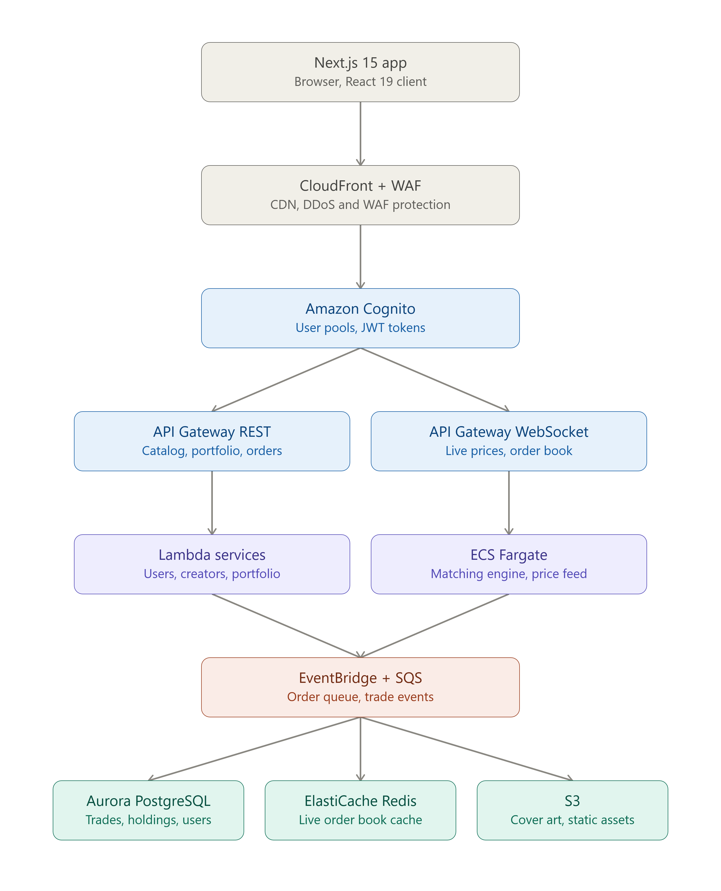
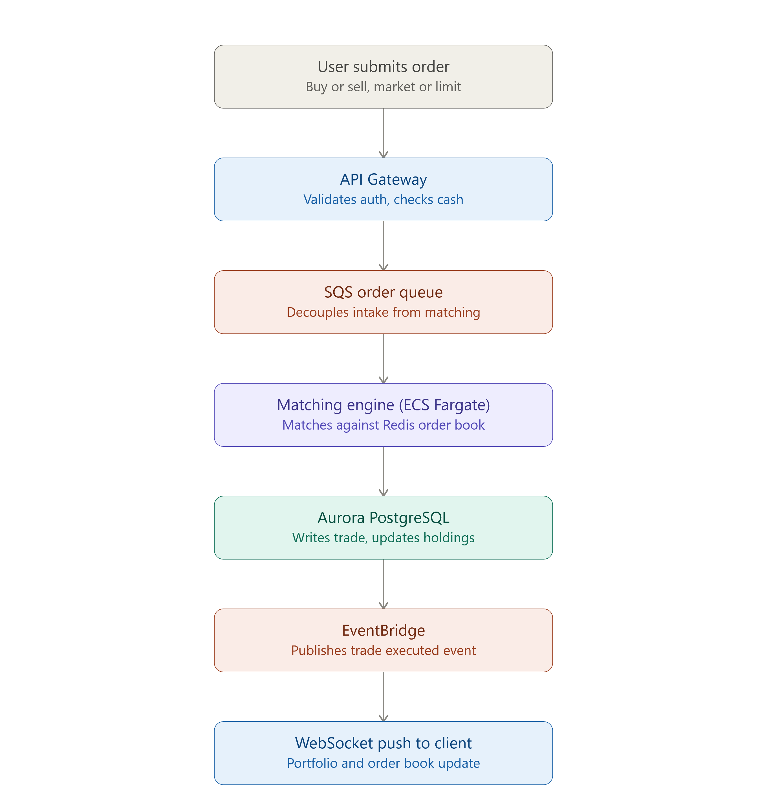

# FolioX

A cross-media creator asset exchange — a demo trading platform where IP owners tokenise
channels, videos, live series, games, books, films, music and UGC pools, and fans buy, hold
and trade revenue-share tokens against them.

Everything is simulated. There is no backend, no database, no wallet, no blockchain and no
real money. All state lives in React memory and resets on page reload.

---

## Table of contents

- [FolioX](#foliox)
  - [Table of contents](#table-of-contents)
  - [What this project is](#what-this-project-is)
  - [Origin: reconstructed from a compiled bundle](#origin-reconstructed-from-a-compiled-bundle)
  - [Architecture](#architecture)
    - [AWS architecture overview](#aws-architecture-overview)
    - [Order placement flow](#order-placement-flow)
  - [Tech stack](#tech-stack)
  - [Getting started](#getting-started)
  - [Project structure](#project-structure)
    - [Why `app/` is thin and `components/pages/` exists](#why-app-is-thin-and-componentspages-exists)
  - [Routes](#routes)
  - [Domain model](#domain-model)
    - [`Creator`](#creator)
    - [`Asset`](#asset)
    - [Asset distribution](#asset-distribution)
    - [Derived values (never stored)](#derived-values-never-stored)
  - [The market store](#the-market-store)
    - [State](#state)
    - [Actions](#actions)
    - [Live price simulation](#live-price-simulation)
    - [Fee handling](#fee-handling)
  - [Deterministic generators](#deterministic-generators)
  - [Design system](#design-system)
    - [Palette](#palette)
    - [Radius scale](#radius-scale)
    - [Custom classes](#custom-classes)
    - [Typography](#typography)
    - [Charts](#charts)
  - [Server vs client components](#server-vs-client-components)
  - [Conventions](#conventions)
  - [Testing and verification](#testing-and-verification)
  - [Known quirks and inherited behaviour](#known-quirks-and-inherited-behaviour)
    - [Deliberate departures from the original](#deliberate-departures-from-the-original)
  - [Where to make common changes](#where-to-make-common-changes)
    - [Adding a new route](#adding-a-new-route)
  - [Disclaimer](#disclaimer)

---

## What this project is

FolioX presents a fictional exchange for "creator assets". The core idea it demonstrates:

1. **Creators tokenise** — a channel, a single video, a live series, a game item, a book, a
   film window, a music catalogue or a pool of user-generated clips is wrapped in a
   capped-supply token that carries a defined share of that property's net revenue.
2. **Fans buy in** — holders receive pro-rata revenue participation plus fan perks (private
   Discord roles, AMAs, watch parties, merch priority, meet-and-greet lotteries).
3. **Hold, access, trade** — tokens trade on a live order book with market and limit orders.

The app ships with six illustrative creators (FaZe Clan, Ed Sheeran, J.K. Rowling,
Christopher Nolan, MrBeast Studio, PixelForge Games) and fourteen assets across eight asset
types. Every creator, name and figure is illustrative — no affiliation is implied and no
securities are offered.

You start with **$5,000** of demo cash. Buying and selling adjust cash, holdings and the
order book immediately.

---

## Origin: reconstructed from a compiled bundle

This is important context for anyone reading the git history.

The repository originally contained **only a compiled Vite production build** — a 380 KB
minified `index.html` + `assets/index-*.js` + `assets/index-*.css`, with no source, no
sourcemaps and no `package.json`. The original was a client-rendered React SPA built in
Perplexity Labs, using Tailwind, shadcn/ui, Radix, lucide-react and `wouter` for hash-based
routing.

The current Next.js codebase was reconstructed from that bundle. Recovery was possible
because Tailwind class strings, copy, data literals and lucide icon names all survive
minification as string literals. Component names, hook structure and file boundaries did
not survive and were re-derived.

The original build is preserved at **`_reference/`** so any change can be diffed against it
visually. It is excluded from `tsconfig.json` and ESLint, and Next.js ignores it because it
sits outside `src/`. To compare side by side:

```bash
npm run build && npm start          # Next.js on :3000
cd _reference && python3 -m http.server 3101   # original SPA on :3101 (hash routes, e.g. /#/markets)
```

Delete `_reference/` once you no longer need the comparison.

---

## Architecture

### AWS architecture overview



### Order placement flow



---

## Tech stack

| Layer | Choice | Notes |
|---|---|---|
| Framework | **Next.js 15**, App Router | Replaces the original's client-side `wouter` router |
| Language | **TypeScript** (strict) | `strict: true`, no `any` in app code |
| UI | **React 19** | |
| Styling | **Tailwind CSS 3.4** | v3 deliberately — the recovered theme uses v3's `hsl(var(--x) / <alpha-value>)` convention |
| Components | **shadcn/ui** patterns on **Radix** | Only the primitives actually used were ported |
| Variants | `class-variance-authority`, `clsx`, `tailwind-merge` | `cn()` in `src/lib/utils.ts` |
| Icons | **lucide-react** | |
| Animation | `tailwindcss-animate` | Drives Radix `data-[state]` enter/exit transitions |
| Fonts | `next/font/google` | Inter (body), Space Grotesk (display), JetBrains Mono (numerics) |

**No** state library, data-fetching library, chart library or backend. Sparklines are
hand-rolled SVG (see [Design system](#design-system) for why that matters).

---

## Getting started

```bash
npm install
npm run dev          # http://localhost:3000
```

| Script | Purpose |
|---|---|
| `npm run dev` | Dev server |
| `npm run build` | Production build (prerenders 26 pages) |
| `npm start` | Serve the production build |
| `npm run lint` | ESLint (`next/core-web-vitals` + `next/typescript`) |
| `npm run typecheck` | `tsc --noEmit` |
| `npm test` | Self-check for the deterministic generators |

---

## Project structure

```
src/
  app/                          # App Router — routing, metadata, prerendering only
    layout.tsx                  # Fonts, <html> font variables, metadata, favicon, providers
    globals.css                 # Design tokens, base layer, custom components/utilities
    page.tsx                    # /
    markets/page.tsx            # /markets
    portfolio/page.tsx          # /portfolio
    creator/[slug]/page.tsx     # /creator/:slug — generateStaticParams + generateMetadata
    asset/[id]/page.tsx         # /asset/:id   — generateStaticParams + generateMetadata
    not-found.tsx               # 404

  components/
    market-store.tsx            # Client state: cash, holdings, assets, books, notices, trading
    site-shell.tsx              # Header, nav, equity/cash readout, footer, toast stack
    logo.tsx                    # LogoMark (SVG) + Logo (mark + wordmark)
    theme-toggle.tsx            # Toggles `.dark` on <html>
    asset-cover.tsx             # Per-asset-type generative SVG artwork
    sparkline.tsx               # Inline SVG price sparkline
    pages/                      # One file per route's view (all client components)
      discover-page.tsx
      markets-page.tsx
      portfolio-page.tsx
      creator-page.tsx
      asset-page.tsx
    ui/                         # shadcn primitives: button, badge, card, input, tabs, dialog

  lib/
    types.ts                    # Creator, Asset, Order, Trade, OrderBook, Holding, Notice
    data/
      creators.ts               # 6 creators
      assets.ts                 # 14 assets
      index.ts                  # Re-exports + lookup helpers
    series.ts                   # buildSpark(), buildOrderBook() — deterministic PRNGs
    series.test.mjs             # Runnable self-check for the above
    format.ts                   # formatCurrency, formatCompact, formatClockTime
    utils.ts                    # cn()

tailwind.config.ts              # Colours, radius scale, shadows, fonts, keyframes
_reference/                     # Original compiled build (comparison only)
```

### Why `app/` is thin and `components/pages/` exists

Every view needs the market store, which is client state. Rather than marking the route
files `"use client"` — which would forfeit `generateStaticParams`, `generateMetadata` and
static prerendering — each `app/**/page.tsx` stays a **server component** that resolves
params, handles `notFound()` and exports metadata, then renders the matching client
component from `components/pages/`.

This keeps route concerns (SEO, prerendering, 404s) separate from view concerns
(interactivity, state).

---

## Routes

| Route | Rendering | View component | Purpose |
|---|---|---|---|
| `/` | Static | `discover-page.tsx` | Hero, creator search, asset classes, creator grid, how-it-works, top 24h movers |
| `/markets` | Static | `markets-page.tsx` | Sortable table of all 14 assets with live prices and sparklines |
| `/portfolio` | Static | `portfolio-page.tsx` | Cash, holdings, unrealised P&L, estimated revenue share, upcoming payouts |
| `/creator/[slug]` | SSG — 6 pages | `creator-page.tsx` | Creator profile, stats, filterable asset cards, issuance progress |
| `/asset/[id]` | SSG — 14 pages | `asset-page.tsx` | Full trading screen: order book, tape, terms, buy/sell panel, confirm dialog |
| `*` | Static | `not-found.tsx` | 404 |

Build output: **26 prerendered pages**.

Valid `creator` slugs: `faze-clan`, `ed-sheeran`, `jk-rowling`, `christopher-nolan`,
`mrbeast-studio`, `pixelforge-games`.

Valid `asset` ids follow `ast_<creator>_<thing>` — e.g. `ast_faze_channel`,
`ast_ed_catalogue`, `ast_nolan_movie`, `ast_pixelforge_skin`.

Unknown slugs and ids call `notFound()`.

---

## Domain model

Defined in `src/lib/types.ts`.

### `Creator`

Profile metadata: `slug`, `name`, `handle`, `audienceReach`, `followers`, `categories`,
`base`, `yearStarted`, `primaryPlatform`, `bio`, `totalAssets`, `totalValueLocked`, and
`accent` — a Tailwind gradient class string (e.g. `"from-red-500 via-orange-500 to-amber-400"`)
interpolated into the profile avatar.

### `Asset`

The tradable instrument.

| Field group | Fields |
|---|---|
| Identity | `id`, `creatorId`, `type`, `title`, `ticker`, `releaseYear` |
| Artwork | `cover` (raw CSS gradient), `coverAccent` (two hex stops for the SVG overlay) |
| Supply | `totalSupply`, `available` |
| Pricing | `pricePerToken`, `previousPrice`, `change24h`, `spark` (30-point history) |
| Economics | `royaltyShare`, `durationMonths`, `monthlyRevenuePool`, `payoutCadence`, `issuer` |
| Content | `activity` + `activityLabel` (e.g. `2.8e9` / `"annual views"`), `description`, `perks`, `revenueStreams` |

`type` is one of `channel | ugc | video | series | music | book | film | game`. It drives
both the label shown in the UI and which generative artwork `AssetCover` draws.

### Asset distribution

| Creator | Assets |
|---|---|
| FaZe Clan | 4 — channel, UGC pool, flagship video, Twitch series |
| Ed Sheeran | 2 — catalogue basket, single drop |
| J.K. Rowling | 2 — book rights, audiobook |
| Christopher Nolan | 2 — film window, documentary |
| MrBeast Studio | 2 — channel basket, specific video |
| PixelForge Games | 2 — game asset, digital item |

### Derived values (never stored)

- **Equity** = cash + Σ(`pricePerToken` × `qty`)
- **Unrealised P&L** = market value − (`avgCost` × `qty`)
- **Est. annual yield** = (`monthlyRevenuePool` × 12 / `totalSupply`) / `pricePerToken` × 100
- **Sold %** = (`totalSupply` − `available`) / `totalSupply` × 100
- **Spread** = best ask − best bid; **mid** = their mean

---

## The market store

`src/components/market-store.tsx` is the single source of runtime truth. It is mounted once
in `app/layout.tsx`, so **state survives client-side navigation** between routes but is lost
on a hard reload — matching the original SPA.

### State

| Key | Meaning |
|---|---|
| `cash` | Demo balance, starts at `$5,000` |
| `holdings` | `{ assetId, qty, avgCost }[]` |
| `assets` | Live copy of the seed data, mutated by trades and the price ticker |
| `books` | `Record<assetId, { bids, asks, trades }>` |
| `notices` | Toast queue, auto-dismissed after 4.5 s |

### Actions

- **`buy(assetId, qty, price)`** — rejects with a warning toast if cost exceeds cash;
  otherwise debits cash, blends the lot into the position's average cost, records the fill
  and decrements `available`.
- **`sell(assetId, qty, price)`** — rejects if the holding is too small; credits cash,
  reduces the position (removing it at zero) and increments `available`.
- **`placeLimit(assetId, side, qty, price)`** — inserts a resting order attributed to
  `"you"` into the sorted book, then fills it after **1.4 s** via `buy`/`sell`.
- **`dismissNotice(id)`**, **`resetDemo()`** — reset restores cash, clears holdings and
  reseeds assets and books.

### Live price simulation

A `setInterval` nudges **one random asset every 4 seconds** by ±0.6%, rewriting
`pricePerToken`, `previousPrice`, `change24h` and shifting the `spark` window. This is why
two browser tabs drift apart, and why prices on `/markets` differ slightly between reloads.
It is cosmetic — not a bug.

### Fee handling

The trade panel displays a **0.50% platform fee** in the subtotal breakdown, but `buy()` and
`sell()` settle at `qty × price` **without** applying it. A $124.00 purchase debits exactly
$124.00 while the panel reads "You pay $124.62". This is faithful to the original — the fee
is presentational only. Fix it in `market-store.tsx` if you want it to actually settle.

---

## Deterministic generators

`src/lib/series.ts` holds two linear congruential generators (`state = (state * 9301 + 49297) % 233280`).

- **`buildSpark(start, points = 30, volatility = 0.06)`** — the 30-point price history behind
  every sparkline, seeded from the asset's opening price and floored at 70% of it.
- **`buildOrderBook(asset)`** — eight bid and eight ask levels either side of the mid price,
  seeded from `round(price * 1000)`, with quantities and trader handles drawn from the same
  stream.

**These must stay deterministic.** They run during static prerendering on the server and
again during hydration on the client; `Math.random()` in either place would produce a
hydration mismatch and React would discard the server markup. Both were checked against the
original bundle's algorithms and produce byte-identical output — `buildOrderBook` across all
14 assets, `buildSpark` across a sample of the seed prices and volatilities in use.

`src/lib/series.test.mjs` locks this down with a captured baseline. Run it after any change
to either function:

```bash
npm test
```

The same constraint is why `Sparkline` derives its SVG gradient id from React's `useId()`
rather than a random suffix.

---

## Design system

Tokens live in `src/app/globals.css` as HSL triplets on `:root` and `.dark`; Tailwind maps
them to utility names in `tailwind.config.ts` via `hsl(var(--x) / <alpha-value>)`, which is
what makes `bg-primary/10`, `border-success/60` and friends work.

### Palette

Light and dark are **not** the same hue rotated. Light is a cool slate-and-teal scheme
(`--primary: 181 70% 31%`). Dark is a warm violet-and-amber scheme
(`--primary: 32 95% 56%`). Switching themes changes the accent colour, by design.

### Radius scale

All radii derive from `--radius: 0.625rem` (10px), reproducing the original's
3 / 4 / 6 / 9 / 12 / 16 px steps:

```
sm 0.3×   DEFAULT 0.4×   md 0.6×   lg 0.9×   xl 1.2×   2xl 1.6×
```

### Custom classes

| Class | Purpose |
|---|---|
| `.aurora-bg` | Layered radial gradients behind the homepage hero; has a separate `.dark` variant |
| `.vinyl` | Conic gradient for record-style artwork |
| `.live-dot` | 1.6 s pulsing "live market" indicator |
| `.font-display` | Space Grotesk with `-0.02em` tracking |
| `.font-mono` | JetBrains Mono with `tnum`/`zero` features |
| `.tabular` | `font-variant-numeric: tabular-nums` — keeps ticking prices from shifting width |
| `.hover-elevate`, `.hover-elevate-2`, `.active-elevate*`, `.toggle-elevate` | Interaction feedback |

The `elevate` family deserves a note: it applies a tinted `::after` overlay at `inset: 0`
(or `-1px` on bordered elements) rather than recolouring the element. That is what lets
gradient- and image-backed surfaces show hover state without losing their own colours.
Opt out per element with `.no-default-hover-elevate` / `.no-hover-interaction-elevate`.

### Typography

Body text sets `font-feature-settings: "cv02","cv03","cv04","cv11","ss01"` — Inter's
single-storey alternates. Numeric columns should carry `font-mono tabular`.

### Charts

There is **no chart library**. `Sparkline` builds an SVG path from a value array; every
"chart" in the app is that component. Adding a charting dependency for a new view would be a
significant departure — consider extending `Sparkline` first.

---

## Server vs client components

| Kind | Files | Why |
|---|---|---|
| **Server** | `app/**/page.tsx`, `app/layout.tsx`, `not-found.tsx`, `asset-cover.tsx`, `logo.tsx` | Params, metadata, static params, pure rendering |
| **Client** | `market-store.tsx`, `site-shell.tsx`, `theme-toggle.tsx`, `sparkline.tsx`, everything in `components/pages/` | Hooks, event handlers, `usePathname`, `useId` |

`AssetCover` and `Logo` are pure SVG with no hooks, so they render on the server and are
usable from either side.

---

## Conventions

- **Path alias** — `@/*` maps to `src/*`. Use it; no `../../` chains.
- **Imports** — external packages first, then `@/` imports, then relative. Alphabetised
  within each group.
- **`cn()` everywhere** — compose classes with `cn()` from `@/lib/utils` so `tailwind-merge`
  can resolve conflicts when a caller overrides a base class.
- **Variants via `cva`** — see `ui/button.tsx` and `ui/badge.tsx`. Add a variant to the
  `cva` config rather than branching on props in JSX.
- **`data-testid`** — preserved verbatim from the original throughout (`button-submit-order`,
  `input-qty`, `link-nav-markets`, `trade-<assetId>`, …). Keep them stable; they are the
  app's automation surface.
- **Money and numbers** — always through `formatCurrency` / `formatCompact`. Never
  hand-roll `toLocaleString` in a view.
- **Comments** — explain *why*, not *what*. The existing comments flag non-obvious
  constraints (hydration, PRNG determinism, overlay technique); match that bar.

---

## Testing and verification

Current verification gates, all passing:

```bash
npm test          # deterministic generators — captured baseline
npm run typecheck # tsc --noEmit, strict
npm run lint      # ESLint
npm run build     # 26 pages prerendered
```

There is no component or e2e test suite. `series.test.mjs` exists because the PRNGs are the
one piece of non-obvious logic where silent drift would corrupt every chart and order book
at once. If you add logic of similar weight — a settlement calculation, a fee change, a
sorting rule with edge cases — leave one runnable check behind it.

For visual work, diff against `_reference/` as described in
[Origin](#origin-reconstructed-from-a-compiled-bundle).

---

## Known quirks and inherited behaviour

Behaviour carried over from the original build, listed so nobody "fixes" it by accident or
assumes it was intentional here.

1. **The 0.50% platform fee is display-only.** Shown in the breakdown and confirm dialog,
   not applied at settlement. See [Fee handling](#fee-handling).
2. **Ed Sheeran's `totalAssets` is `3`, but only 2 assets exist for him.** The Discover page
   and creator grid read `creator.totalAssets` (shows 3); the creator page counts real
   assets (shows 2). Same data, two numbers. Fix by setting `totalAssets: 2` in
   `src/lib/data/creators.ts`, or by deriving the field instead of storing it. All other
   creators are consistent.
3. **The 404 copy reads "Did you forget to add the page to the router?"** — leftover
   scaffolding text from the original, meaningless to an end user. Preserved deliberately;
   worth rewriting.
4. **The theme always starts light.** `ThemeToggle` initialises to `false` and holds the
   state in memory, so the choice does not survive a reload. Persist it in `localStorage`
   with an inline pre-hydration script if you want it to stick without a flash.
5. **Payout dates are localised to the browser.** `toLocaleDateString(undefined, …)` in the
   portfolio's "Upcoming payouts" renders in the visitor's locale — a Brazilian browser
   shows `18 de out.`. Pass an explicit locale if you need it fixed.
6. **`autoFocus` on the homepage search** steals focus on load and can jump the scroll
   position on small viewports.

### Deliberate departures from the original

Three changes were made knowingly; all are visually identical to the original.

| Change | Reason |
|---|---|
| `Sparkline` gradient id uses `useId()` instead of `Math.random()` | A random id differs between server and client render and breaks hydration under SSR |
| Portfolio payout dates derive from the asset id instead of `Math.random()` | The original re-rolled the date on every render, so it visibly jumped every 4 s when the price ticker fired |
| `recharts` removed | Present in the original's compiled CSS but unused by any component — all charts are hand-rolled SVG |

---

## Where to make common changes

| Task | File |
|---|---|
| Add or edit a creator | `src/lib/data/creators.ts` — new slugs prerender automatically |
| Add or edit an asset | `src/lib/data/assets.ts` — use `buildSpark(openingPrice, 30, volatility)` for `spark` |
| Add an asset **type** | `AssetType` in `src/lib/types.ts`, then a `case` in `CoverArt` (`asset-cover.tsx`) |
| Change trading rules, fees, starting cash | `src/components/market-store.tsx` (constants at the top) |
| Change colours, radius, shadows | `src/app/globals.css` for tokens, `tailwind.config.ts` for the Tailwind mapping |
| Change header, nav or footer | `src/components/site-shell.tsx` (`NAV_ITEMS` for links) |
| Change page copy | The relevant file in `src/components/pages/` |
| Add a shadcn primitive | `src/components/ui/` — match the existing `forwardRef` + `cn()` shape |
| Change page titles or descriptions | `metadata` / `generateMetadata` in the matching `app/**/page.tsx` |

### Adding a new route

1. Create the view in `src/components/pages/<name>-page.tsx` with `"use client"`.
2. Create `src/app/<segment>/page.tsx` as a **server** component that exports `metadata` and
   renders the view.
3. Add it to `NAV_ITEMS` in `site-shell.tsx` if it belongs in the nav — the active state
   compares against `usePathname()`.

---

## Disclaimer

FolioX is a product demonstration. Creator names are used illustratively and imply no
affiliation or endorsement. No securities are offered, no revenue-share agreement exists,
and no real funds move at any point.
